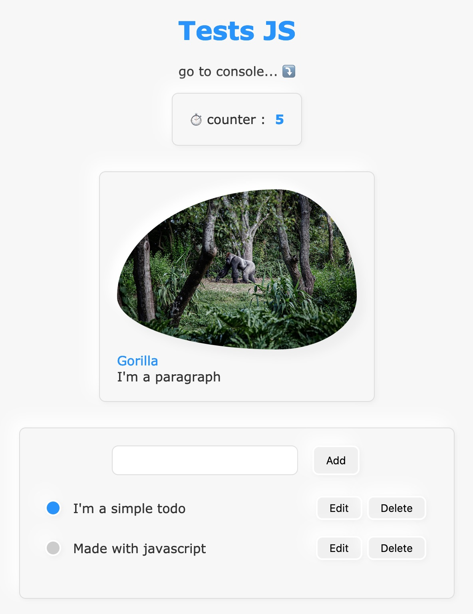

<h1 align="center">Just a few simple exercises in Javascript 👋</h1>

### 🚀 [My Live Page](https://ipopop.github.io/dyma-fr-revision-JS/)
--- 

> thank's to '[Dyma.fr](https://dyma.fr)' for the lessons
---

    .
    ├── assets
    │   └── img
    │       ├── img-01.jpg
    │       └── img-02.jpg
    ├── src
    │   ├── css
    │   │   ├── main.css
    │   │   └── todo.css
    │   └── js
    │       ├── asyncAndTimers.js
    │       ├── dom.js
    │       ├── index.js
    │       └── todo.js
    └── index.html